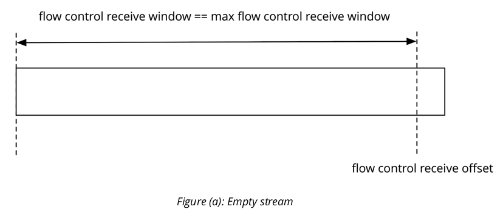
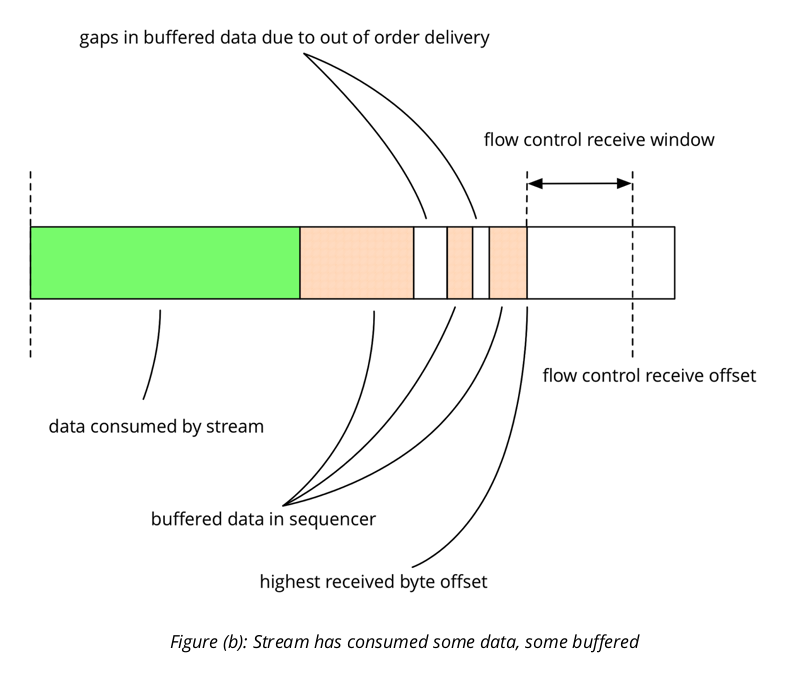
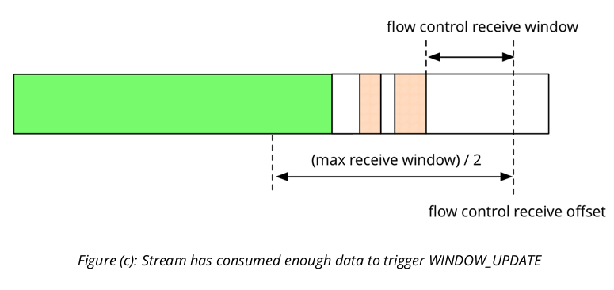
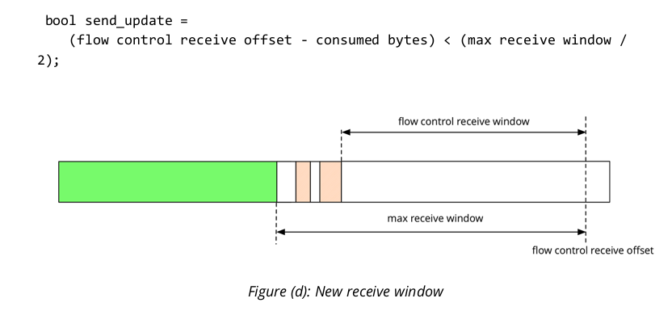
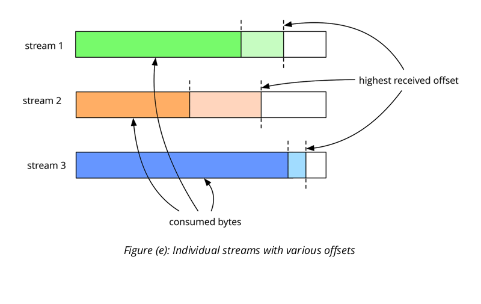
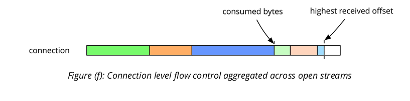

本文是对原版 [Flow control in QUIC](https://docs.google.com/document/d/1F2YfdDXKpy20WVKJueEf4abn_LVZHhMUMS5gX6Pgjl4/edit)
的翻译。
翻不了墙的同学来此处下载 [github](https://github.com/jumptosun/books/tree/master/google-quic)。

# 概述
和 Http2 一样, Quic 协议在 connecton 层和 stream 层都提供了流量控制。连接的一端发送
WINDOW_UPDATE 帧(frame)来增大流量控制的窗口, 发送 BLOCKED 帧来通知因流量控制阻塞。    
    
有限的内存资源是服务端使用流控的动机之一: 为了避免无限制的分配内存，需要一种机制来限制客户端
的发送。

# Stream 的流控
stream 的流控机制, connection 连接上的一端通知另一端每一路 stream 上愿意接收的数据量。

在 quic 协议中， 流量控制通过通知对端所希望收到的数据偏移量的绝对值来实现。例如, 我们通知对端
可以发送到 200 字节， 并且发送端已经发送到 150 字节， 那么对端再发送 50 字节就会阻塞。只有
我们消费了数据， 我们才会发送 WINDOW_UPDATE 来通知对方发送接下来的数据。



stream 的两端都可以自主的选择最大接收窗口。对端应该以此为基础来分配资源。如果内存足够，可以分
配较多的资源例如 100Mb, 通常在繁忙的服务器上我们选择设置为 64Kb。 图 (a) 显示 stream 刚
创建时的情况。它没有从对端收到任何数据，所以它的接受流控窗口 (flow control recieve window)
等于流的最大接收窗口(maximum stream receive window)。当有数据来临时，如果对端发送了足够
多的数据，那么接收窗口会逐渐减小直至0。



图 (b) 显示了对端已经发送部分数据的情况。我们已经消费了一些数据，同时缓存了一些数据。缓存数据中
的间隙 (gaps) 是因为部分包 (packet) 发生乱序。要注意到，接收流控窗口会随着接收数据的最大偏移
量的增大而变小，而不是随着总缓存数据量变化。这是因为发送端一定是顺序发送，不会产生数据间隙。如果
在最大偏移量之前有数据间隙，那么一定是有数据包在传输过程中乱序或丢失了。

我们将记录每一条 stream 的最大偏移量。每一帧到达时，我们会查看是否需要改变偏移量，但它只会增加。
当一条 stream 结束时，对端一定要发送通知它已发送的最大数据偏移量。这可以通过发送 FIN 或 RST
包来实现，它们中都包含了结束偏移量。



现在我们消费了更多的数据。和 chromium http2 中的策略一样，发送 WINDOW_UPDATE 的时机如下:

bool send_update = 
    (flow control receive offset - consumed bytes) < (max receive window / 2);

发出的 WINDOW_UPDATE 中设置的接收流控偏移量为: 
    it = (consumed bytes + max receive window).



# Connection 的流控
如果只有 stream 流控的话，是不足以防止过量的数据。比如:客户端打开最大数量(现在为100)的 stream,
并且每一路都尽可能多的发送。因此,为了限制各个 stream 的总带宽,我们也需要在 connection 上做限制。

connection 上的流量控制和 stream 一样, 只是小号的字节数和接收偏移量是所有 stream 的总和。当一路
stream 消耗数据是， 它不只更新自己的状态， 还会更新所在 connection 的状态。

例如，观察下面几路 stream, 每一路都接受了一些数据， 并且数据并没有被完全消费。

- Stream 1 已经接受到 100 bytes 数据， 并且已经消费了 80 字节数据。
- Stream 2 已经接受到 90 bytes 数据， 并且已经消费了 50 字节数据。
- Stream 3 已经接受到 110 bytes 数据， 并且已经消费了 100 字节数据。

合在一起，connection 总共接收到 300 字节数据， 已经消费了 230。





connecton 上总体的流量控制意味着， 即使单独有一路非常慢的 stream (比如说和后端交互) 也并不会完全阻
塞整个 connecton : connecton 中总的 WINDOW_UPDATE 允许其他 stream 正常的接收数据，而慢的那一
路 stream 会被阻塞。

# 其他考量和实现细节
在处理 stream 和 connection 流量控制时，还有其他一些必须考虑到的细节。在足够的时间内 (比如说一个
RTT内), 连接的两端必须能同步到彼此的状态。 比如说, 发送端认为可以发送为 N 的数据量, 接收端期望接收到
的数据为 M, 如若 N > M， 势必会造成 connection 因为接收过多数据的而断开。 相反的如若 N < M, 
会陷入如下状况, 发送端停止发送，等待一个永远不会到达的 WINDOW_UPDATE。

## RST mid-stream
在 connection 的一端, 当数据还没有完全接收或发送完成时, 就去重置 (reset) 一路 stream, 会发生什么 
(例如关闭 chrome 一个标签)。 当接收到 RST 后, 端 A 会关闭对应的 stream, 并且忽略随后来的数据包。 
这样可能会造成链接两端的不同步: RST 可能因为乱序，在数据包之前到达, 此时还有部分数据在传输中。
(此时发送端 B, 已经连带所有的数据包结算过 connection 上的发送窗口)

除非 A 推算出 B 在 stream 发送了多少数据, 他不可能同步两端流量控制的状态, 因此两端的状态会偏离。 
为了解决这个问题, 我们在 RST 包中加入了最终的数据偏移。这意味着收到 RST 的同时， 我们就一定会知道对端
发送了多少数据, 从而能很好地同步两端的状态。 

## RST in reply to RST
B 也需要知道, A 在重置前发送了多少数据。在收到 RST 后, A 并不能仅仅只关闭 stream, 同时也需要告诉 B
自己发送的数据量。有两种办法可以通知对方在 stream 上发送的数据量:

- 携带有最终数据偏移量的 RST 帧
- 带有 FIN 标志的数据帧

因此 QUIC 协议中， 连接的两端一定要发送 RST 或 带有 FIN 标志的数据帧, 在 stream 结束时。 如果你收到
了 RST 帧，并且没有发送 RST 或 带有 FIN 标志位的数据帧， 那么你需要发送 RST 作为回应。 你可以确信对方
已经收到了最终数据偏移量, 并且调整connection 的状态并且关闭 stream。

## BLOCKED frames
QUIC协议中，当一端有数据发送，但因流控被阻塞，便会发送 BLOCKED 帧。理想情况下，通过 WINDOW_UPDATE 
调整的使之适应当下带宽，BLOCKED不应该经常出现。在调试和监听模式下，BLOCKED 帧是没有意义的。

## 默认值
在发送时，QUIC 的流控有如下默认值 (详见 Chromium’s quic_protocol.h):

```

// Minimum size of initial flow control window, for both stream and session.
// stream 和 session ( 同connection ) 中最小流量控制窗口
const​ ​ uint32_t​ ​ kMinimumFlowControlSendWindow​ = ​ 16​ * ​ 1024​ ; ​ // 16 KB

// Maximum flow control receive window limits for connection and stream.
// stream 和 connection 中最大流量控制窗口
const​ ​ QuicByteCount​ ​ kStreamReceiveWindowLimit​ = ​ 16​ * ​ 1024​ * ​ 1024​ ;
// 16 MB
const​ ​ QuicByteCount​ ​ kSessionReceiveWindowLimit​ = ​ 24​ * ​ 1024​ * ​ 1024​ ; ​ // 24 MB

```

对带着 body, 一个 RTT 以内的请求，16KB 的最小值是必要的。当前的实现细节建议在握手阶段设置更大窗口,
通过携带者 kSFCW(Stream Flow Control Window) 和 kCFCW (Connection Flow Control Window)
信息的 CHLO 和 SHLO。

Chromium 当前的设置:    
CFCW:​ 15728640 // 15 MB    
SFCW:​ 6291456 // 6 MB    


谷歌服务器当前的设置:    
CFCW:​ 1572864 // 1.5 MB    
SFCW:​ 1048576 // 1 MB   

# Auto-tuning max receive window (自适应最大接收窗口)
大多数 TCP 协议实现包含最大接收窗口的自动调整, 例如 linux 的实现中的 tcp_moderate_rcvbuf, 详见 L
inux tcp manpage​。如下所见，我们在 QUIC 协议中实现了相同的机制。

## 原理
正如大多数 TCP 的自适应窗口实现版本一样， 基础原理都是， 启动时设置一个相对较小的窗口，然后逐渐增大到所需
的大小。为了简单起见，窗口可能增大，但从不减小 (这点和拥塞控制不同)。

最理想的窗口大小，应该正好包含 一个 时延带宽积 (bandwidth delay product, BDP)的数据量, 可以稍小，但
不能大太多。 过小会影响通信， 过大会浪费。

窗口更新是 QUIC 流控中最重要的概念的设计，他同时提供了一种非常便利的方式来自适应最理想的窗口大小。算法会比较
两个连续 window update 间隔， 和 QUIC 中已经测算出的 RTT 。如果相对于 BDP 来说， 流控窗口太小，那么
每一个 RTT 都会更新窗口。

或者，当窗口大小为理想值时，窗口更新仍然在稍大于 RTT 时间内频繁发生， 那么窗口调整的时间变为 2 RTT。
> 翻译不清楚，贴上原文    
> Alternatively, when the window is sized to the ideal, window updates can be expected
> to occur with frequency corresponding to more than the 1 RTT indicative of blocking, but
> not too much more. The default target chosen for auto-tuning corresponds to 2 RTTs.
> (since updates are triggered at the half-way point of the window, this corresponds to a total
> window size target of 4 RTTs). 

同时算法也设置了最大窗口上限，值根据进一步的安全检查和内存情况来确定(memory pressure)。

## 算法
- 如上所述， 窗口更新在如下情况下会被触发:    
    available window < max window size / 2,    
    此处 available window = max receive window offset - bytes consumed

- 为了实现窗口自适应，在发送 window update 前执行如下逻辑:    
    - 监测连续的两个 window update 的间隔， 称之为 since_last_update. 
    - 如果 ( since_last_update < RTT * trigger factor ) 那么设置最大窗口为:    
        size = MIN(max window size * increase factor, upper bound).
        - trigger factor​ is 2
        - increase factor​ is 2    
    
- 如上所述:    
    max_received window offset += (max window size - available window)


## 默认值
谷歌服务器默认开启了接收缓存自适应，初始值如下:    


CFCW:​ 49152 // 48 KB    
SFCW:​ 32768 // 32 KB

Chromium 默认关闭了该机制。

