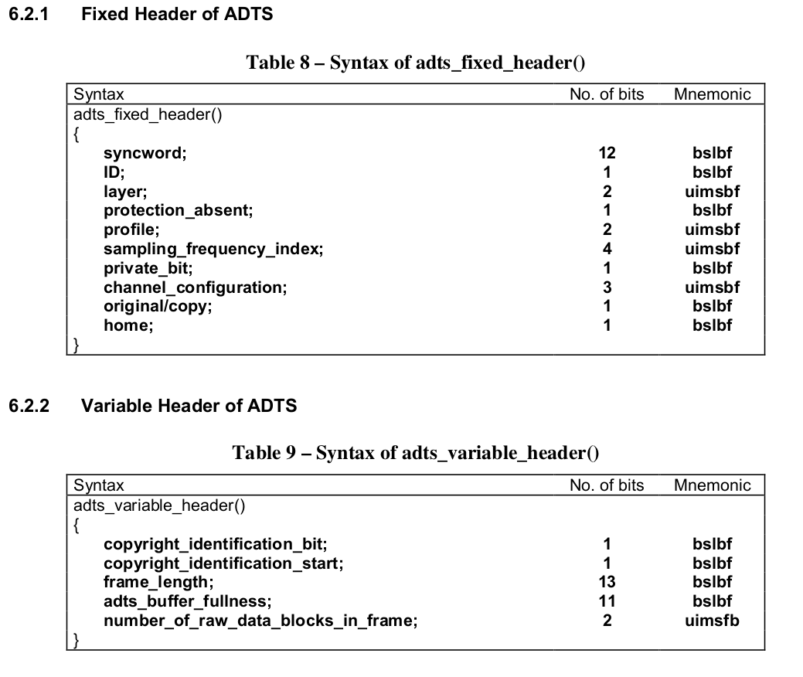
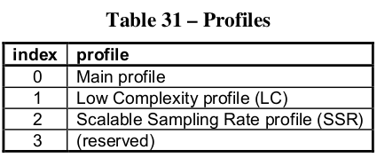
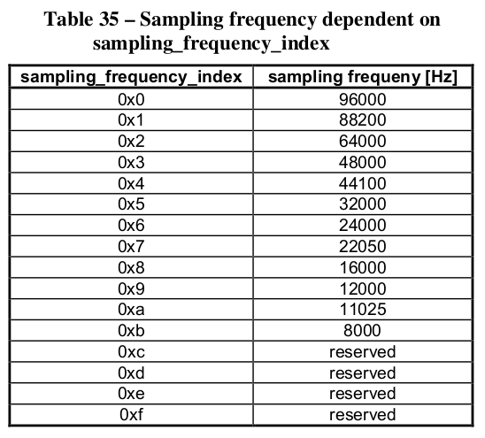

总结一下 aac 的封装和代码，避免每回开发都从头找资料。


## mpeg2-aac

mpeg2中, aac 有两种封装结构 adif 和 adts，但只有 adts 比较常见。以下资料出自
aac-iso-13818-7。


从上图可以看出 aac 由若干 adts_frame 组成。每个 frame 由 syncword(1111 1111 1111)分隔。每个 adts_frame 由头信息和数据组成。

其中 adts_fixed_heade 和 adts_variable_header 合起来为7个字节，做简单解释。



- profile   
  压缩率和复杂度是相对的，为了满足不同需求，提供了3种的规格。



- sampling_frequency_index
  音频采样率


- channel_configuration  
  声道设置

- frame_length
  frame 的总字节数，包括头部和错误校验。

ffmpeg 中对 header 的处理 (adtsenc.c)

``` C
static int adts_write_frame_header(ADTSContext *ctx,
                                   uint8_t *buf, int size, int pce_size)
{
    PutBitContext pb;

    unsigned full_frame_size = (unsigned)ADTS_HEADER_SIZE + size + pce_size;
    if (full_frame_size > ADTS_MAX_FRAME_BYTES) {
        av_log(NULL, AV_LOG_ERROR, "ADTS frame size too large: %u (max %d)\n",
               full_frame_size, ADTS_MAX_FRAME_BYTES);
        return AVERROR_INVALIDDATA;
    }

    init_put_bits(&pb, buf, ADTS_HEADER_SIZE);

    /* adts_fixed_header */
    put_bits(&pb, 12, 0xfff);   /* syncword */
    put_bits(&pb, 1, 0);        /* ID */
    put_bits(&pb, 2, 0);        /* layer */
    put_bits(&pb, 1, 1);        /* protection_absent */
    put_bits(&pb, 2, ctx->objecttype); /* profile_objecttype */
    put_bits(&pb, 4, ctx->sample_rate_index);
    put_bits(&pb, 1, 0);        /* private_bit */
    put_bits(&pb, 3, ctx->channel_conf); /* channel_configuration */
    put_bits(&pb, 1, 0);        /* original_copy */
    put_bits(&pb, 1, 0);        /* home */

    /* adts_variable_header */
    put_bits(&pb, 1, 0);        /* copyright_identification_bit */
    put_bits(&pb, 1, 0);        /* copyright_identification_start */
    put_bits(&pb, 13, full_frame_size); /* aac_frame_length */
    put_bits(&pb, 11, 0x7ff);   /* adts_buffer_fullness */
    put_bits(&pb, 2, 0);        /* number_of_raw_data_blocks_in_frame */

    flush_put_bits(&pb);

    return 0;
}
```

## mpge4-aac

mpeg4 中增加了更多的可选工具 (profile)，提供了更灵活的封装方式，但同时也保留了 mpeg2 中的封装。新增的的 profile 见 iso-14496-3 table 1.1。封装格式新增 latm, mp4a。

#### 1. LATM格式 (iso-14496-3 1.7)

LATM 的全称为“Low-overhead MPEG-4 Audio TransportMultiplex”（低开销音频传输复用），
TS 中 aac 封装可以采用 adts 和 latm 的方式

LATM 主要由 AudioSpecificConfig（1.6.2 ）与PayloadLengthInfo（负载长度信息）和PayloadMux（负载净荷）组成。

mpeg4 中最基础的编码称为 General Audio Coding (GA), 包括了部分头信息 GASpecificConfig (iso-14496-3 4.4.1) 和 raw_data_blocks。
是常见的负载 (bitstream) 形式。

ffmpeg 中 latm (latmenc.c) 头处理

```C

static void latm_write_frame_header(AVFormatContext *s, PutBitContext *bs)
{
    LATMContext *ctx = s->priv_data;
    AVCodecParameters *par = s->streams[0]->codecpar;
    int header_size;

    /* AudioMuxElement */
    put_bits(bs, 1, !!ctx->counter);

    if (!ctx->counter) {
        /* StreamMuxConfig */
        put_bits(bs, 1, 0); /* audioMuxVersion */
        put_bits(bs, 1, 1); /* allStreamsSameTimeFraming */
        put_bits(bs, 6, 0); /* numSubFrames */
        put_bits(bs, 4, 0); /* numProgram */
        put_bits(bs, 3, 0); /* numLayer */

        /* AudioSpecificConfig */
        if (ctx->object_type == AOT_ALS) {
            header_size = par->extradata_size-(ctx->off >> 3);
            avpriv_copy_bits(bs, &par->extradata[ctx->off >> 3], header_size);
        } else {
            // + 3 assumes not scalable and dependsOnCoreCoder == 0,
            // see decode_ga_specific_config in libavcodec/aacdec.c
            avpriv_copy_bits(bs, par->extradata, ctx->off + 3);

            if (!ctx->channel_conf) {
                GetBitContext gb;
                int ret = init_get_bits8(&gb, par->extradata, par->extradata_size);
                av_assert0(ret >= 0); // extradata size has been checked already, so this should not fail
                skip_bits_long(&gb, ctx->off + 3);
                ff_copy_pce_data(bs, &gb);
            }
        }

        put_bits(bs, 3, 0); /* frameLengthType */
        put_bits(bs, 8, 0xff); /* latmBufferFullness */

        put_bits(bs, 1, 0); /* otherDataPresent */
        put_bits(bs, 1, 0); /* crcCheckPresent */
    }

    ctx->counter++;
    ctx->counter %= ctx->mod;
}

```


#### 2. MP4a

MP4a 就是 mp4 纯音频形式。通常的后缀名为 m4a, mp4a等。

## 单双声道的差别
## 插入空白音频
