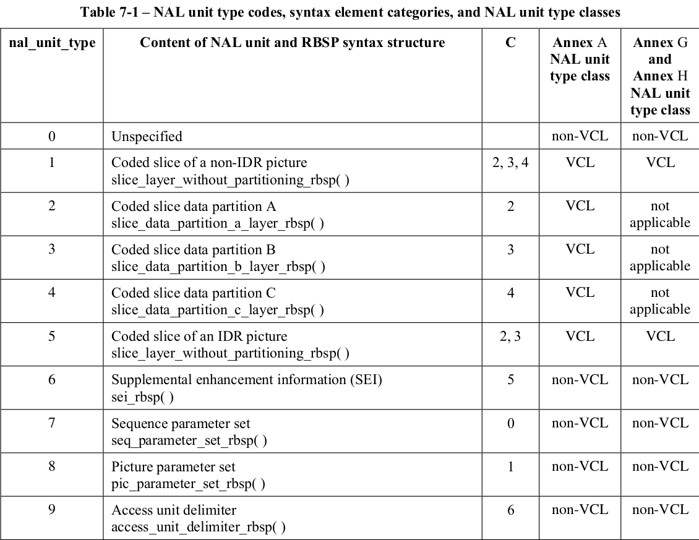
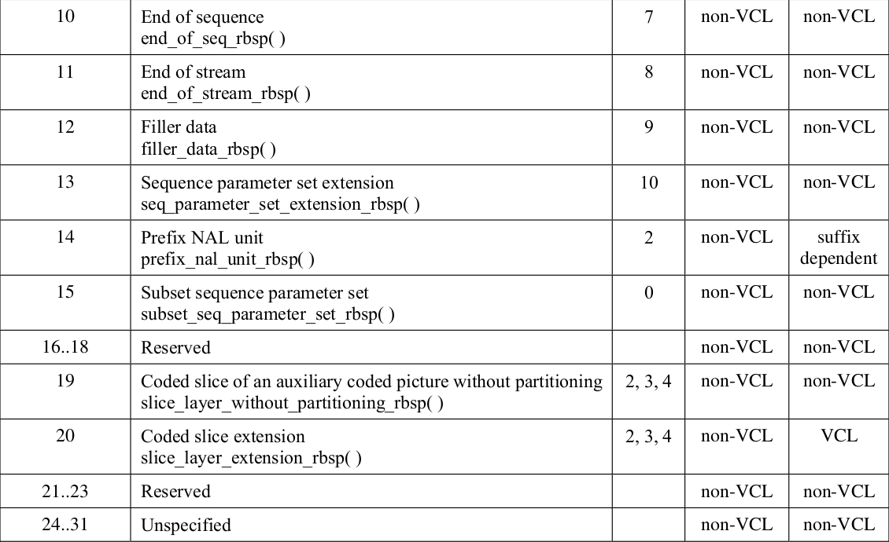
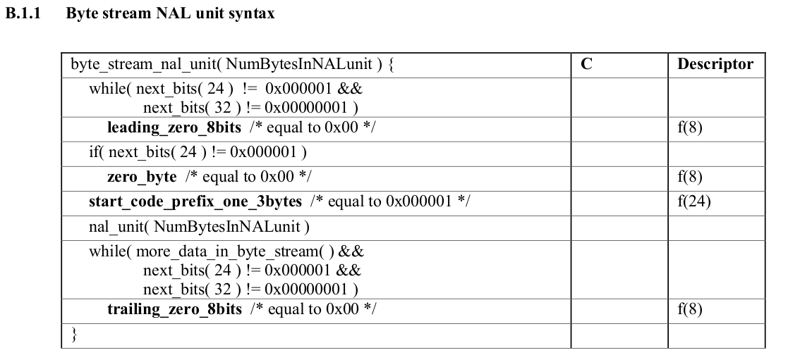
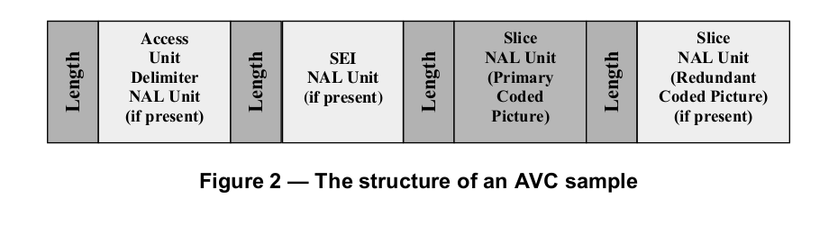
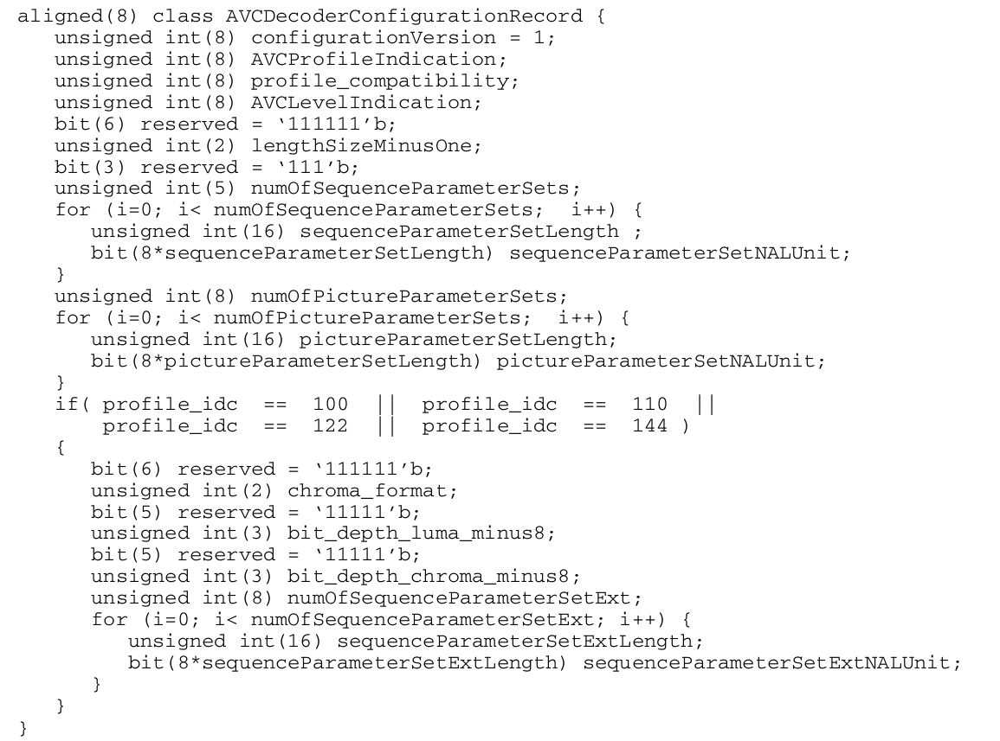

avc (h264) 参考资料。
iso-14496-10 (NALU, annexb), iso-14496-15, iso-14496-12。

## AVC 中的重要概念

原文出自 iso-14496-10 3.0

primary coded picture: The coded representation of a picture to be used by the decoding process for a
bitstream conforming to this Recommendation | International Standard. The primary coded picture contains all
macroblocks of the picture. The only pictures that have a normative effect on the decoding process are primary
coded pictures. See also redundant coded picture.

access unit: A set of NAL units that are consecutive in decoding order and contain exactly one primary coded
picture. In addition to the primary coded picture, an access unit may also contain one or more redundant coded
pictures, one auxiliary coded picture, or other NAL units not containing slices or slice data partitions of a
coded picture. The decoding of an access unit always results in a decoded picture.    
通过对 access unit 解码， 总是可以得到一张图片。

NAL (Network Abstraction Layer) unit: A syntax structure containing an indication of the type of data to follow and bytes containing that
data in the form of an RBSP interspersed as necessary with emulation prevention bytes.

B slice: A slice that may be decoded using intra prediction or inter prediction using at most two motion vectors
and reference indices to predict the sample values of each block.

P slice: A slice that is not an SP slice that may be decoded using intra prediction or inter prediction using at
most one motion vector and reference index to predict the sample values of each block.

instantaneous decoding refresh (IDR) picture: A coded picture for which the variable IdrPicFlag is equal
to 1. An IDR picture causes the decoding process to mark all reference pictures as "unused for reference"
immediately after the decoding of the IDR picture. All coded pictures that follow an IDR picture in decoding
order can be decoded without inter prediction from any picture that precedes the IDR picture.   
任何出现在 IDR 帧后的帧，不要任何来自 IDR 帧之前的信息。

coded video sequence: A sequence of access units that consists, in decoding order, of an IDR access unit
followed by zero or more non-IDR access units including all subsequent access units up to but not including
any subsequent IDR access unit.    
一个 access unit 只包含一个 IDR 帧。

sequence parameter set: A syntax structure containing syntax elements that apply to zero or more entire
coded video sequences as determined by the content of a seq_parameter_set_id syntax element found in the
picture parameter set referred to by the pic_parameter_set_id syntax element found in each slice header.   
应用于一个或多个 coded video sequence。IDR 中必然含有 sps，应用于后来的一个或多个 access unit。

picture parameter set: A syntax structure containing syntax elements that apply to zero or more entire coded
pictures as determined by the pic_parameter_set_id syntax element found in each slice header.

start code prefix: A unique sequence of three bytes equal to 0x000001 embedded in the byte stream as a prefix
to each NAL unit. The location of a start code prefix can be used by a decoder to identify the beginning of a
new NAL unit and the end of a previous NAL unit. Emulation of start code prefixes is prevented within NAL
units by the inclusion of emulation prevention bytes.


## NAL 定义




ffmpeg h264.h
``` C
/* NAL unit types */
enum {
    H264_NAL_SLICE           = 1,
    H264_NAL_DPA             = 2,
    H264_NAL_DPB             = 3,
    H264_NAL_DPC             = 4,
    H264_NAL_IDR_SLICE       = 5,
    H264_NAL_SEI             = 6,
    H264_NAL_SPS             = 7,
    H264_NAL_PPS             = 8,
    H264_NAL_AUD             = 9,
    H264_NAL_END_SEQUENCE    = 10,
    H264_NAL_END_STREAM      = 11,
    H264_NAL_FILLER_DATA     = 12,
    H264_NAL_SPS_EXT         = 13,
    H264_NAL_AUXILIARY_SLICE = 19,
};
```

## NALU 的顺序

出自 iso-14496-10
7.4.2.1 Order of NAL units and association to coded pictures, access units, and video sequences

描述了 access unit， 编码后的图片, 视频序列之间的关系。很重要，要读一遍。

- 7.4.1.2.1 sps, pps 的顺序和激活

  The sequence and picture parameter set mechanism decouples the transmission of infrequently changing information
  from the transmission of coded macroblock data. Sequence and picture parameter sets may, in some applications, be conveyed
  "out-of-band" using a reliable transport mechanism.
  因为 sps, pps 用来解码传输的宏块，所以其中的信息不会经常变化。 所以在一些应用中, sps pps 可以通过一些可靠机制来传输,
  称之为 out-of-band。

  sps, pps 在被用到之前，就应该被准备好。 激活(active)的 sps, pps, 在下一个 set 被激活后， 应该处于 actived 的状态。
  同一 id 如果再次出现， 那么前一个拥有此 id 的 set 将被替换。


- 7.4.1.2.2 access unit 的顺序，以及和 coded video sequence 的关系
  coded video sequence 应该包含一个或多个 access unit， 并且同一 cvq 中应该符合同一种 profile (annex A中有描述) .
  cvq 中第一个 access unit 应该是 IDR, 并且该 cvq 中只能包含这一个 IDR。

  cvq 中两个连续的 access unit, 如果都包含实际的图片信息，那么 picture order count 应该递增。

  一个新的 access unit 的标志:
  – access unit delimiter NAL unit (when present),
  – sequence parameter set NAL unit (when present),
  – picture parameter set NAL unit (when present),
  – SEI NAL unit (when present),
  – NAL units with nal_unit_type in the range of 14 to 18, inclusive (when present),
  – first VCL NAL unit of a primary coded picture (always present).

  access unit 中应该遵守的规则
  – When an access unit delimiter NAL unit is present, it shall be the first NAL unit. There shall be at most one access
  unit delimiter NAL unit in any access unit.
  – When any SEI NAL units are present, they shall precede the primary coded picture.
  – When an SEI NAL unit containing a buffering period SEI message is present, the buffering period SEI message
  shall be the first SEI message payload of the first SEI NAL unit in the access unit.
  – The primary coded picture shall precede the corresponding redundant coded pictures.
  – When redundant coded pictures are present, they shall be ordered in ascending order of the value of
  redundant_pic_cnt.
  – When a sequence parameter set extension NAL unit is present, it shall be the next NAL unit after a sequence
  parameter set NAL unit having the same value of seq_parameter_set_id as in the sequence parameter set extension
  NAL unit.
  – When one or more coded slice of an auxiliary coded picture without partitioning NAL units is present, they shall
  follow the primary coded picture and all redundant coded pictures (if any).
  – When an end of sequence NAL unit is present, it shall follow the primary coded picture and all redundant coded
  pictures (if any) and all coded slice of an auxiliary coded picture without partitioning NAL units (if any).
  – When an end of stream NAL unit is present, it shall be the last NAL unit.
  – NAL units having nal_unit_type equal to 0, 12, or in the range of 20 to 31, inclusive, shall not precede the first VCL
  NAL unit of the primary coded picture.


## 字节流格式 (byte stream format)

字节流格式, 出自 14496-10 annex b。



解视频流过程:
1. 检测 0x00 00 00 01
2. 检查 0x00 00 01
3. NALU 的结束标志为
  - 0x00 00 00 00
  - 0x00 00 00 01
  - 字节流被中断
4. NumBytesInNALunit bytes are removed from the bitstream and the current position in the byte stream is
advanced by NumBytesInNALunit bytes. This sequence of bytes is nal_unit( NumBytesInNALunit ) and is
decoded using the NAL unit decoding process.   (没看懂, -.-)
5. 上个 NALU 结束，如果下三或四个字节不是 0x00 00 01  或 0x00 00 00 01 ， 那么直达检测到 0x00 00 00 01 之前
数据会被忽略。

如果数据中出现 0x00 00 01, 会在第三字节前插入 0x03, 变成 0x00 00 03 01。

## AVC 文件格式

出自 iso-14496-15

Video Elementary Streams: 包含实际图片压缩后数据的 NAL 流， nal_unit_type 不等于 7, 8, 13
Parameter Set Elementary Streams: 包含 sps, pps 的 NAL 流， nal_unit_type 等于 7, 8, 13

iso-14496-15 5.2:

Canonical order and restrictions, AVC 基本的顺序和要求。
定义了最基本的要求，来满足最基本的传输，例如 TS, RTP。
有很多，建议全部阅读，翻译部分:
 - 所有的时间信息都应该在 stream 以外提供, 即便 SEI 中有时间信息，也应该被忽略。
 - 不应该含有 Annex b 中的 start_code。

AVC sample 相当于 access unit。并且每一帧 sample 都应该有对应的时间信息在外部。  

  

 - length: 前缀的长度在下面的 decoder configure information 中提供。

decoder configure information:

> Explicit indication can be provided in the AVC Decoder Configuration Record about the chroma format and bit
> depth used by the avc video elementary stream. The parameter ‘chroma_format_idc’ present in the
> sequence parameter set in AVC specifies the chroma sampling relative to the luma sampling. Similarly the
> parameters ‘bit_depth_luma_minus8’ and ‘bit_depth_chroma_minus8’ in the sequence parameter set
> specify the bit depth of the samples of the luma and chroma arrays. The values of chroma_format_idc,
> bit_depth_luma_minus8’ and ‘bit_depth_chroma_minus8’ must be identical in all sequence
> parameter sets in a single AVC configuration record. If two sequences differ in any of these values, two
> different AVC configuration records will be needed. If the two sequences differ in color space indications in
> their VUI information, then two different configuration records are also required  

解码器配置信息中可以提供明确的色域信息，色与深度。但是要同 parameter set 中的信息保持一致。




lengthSizeMinusOne indicates the length in bytes of the NALUnitLength field in an AVC video
sample or AVC parameter set sample of the associated stream minus one. For example, a size of one
byte is indicated with a value of 0. The value of this field shall be one of 0, 1, or 3 corresponding to a
length encoded with 1, 2, or 4 bytes, respectively.
